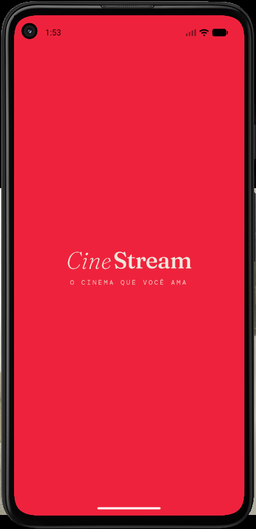
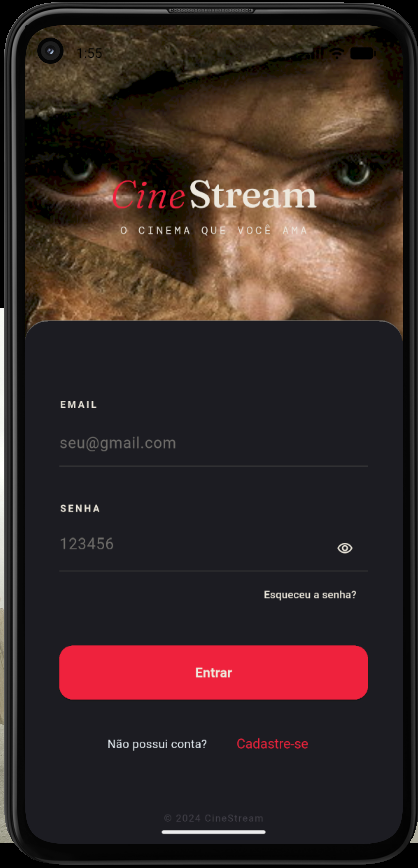
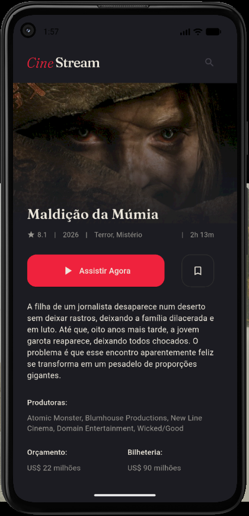

# CineStream - CineApp


Aplicativo mobile desenvolvido em **Flutter** para listar filmes populares e exibir informações detalhadas consumidas da API do **The Movie Database (TMDB)**.

O projeto foi construído como parte de um desafio técnico Flutter, com foco em organização de código, componentização de interface, consumo de API, navegação entre telas e gerenciamento simples de estado usando recursos nativos do Flutter.

---

## Demonstração

### Telas

| Splash | Login |
|---|---|
|  |  |

| Home | Detalhes |
|---|---|
|  |  |

---

## Funcionalidades

- Tela de splash com identidade visual do CineStream.
- Tela de login com validação simples de campos.
- Carregamento inicial com feedback visual.
- Listagem de filmes populares consumidos da API TMDB.
- Filme em destaque na tela inicial.
- Listas horizontais de pôsteres.
- Navegação para tela de detalhes usando rotas nomeadas.
- Tela de detalhes com sinopse, avaliação, ano, gêneros, duração, produtoras, orçamento, bilheteria e idiomas.
- Tratamento de erro para imagens quebradas e falhas de requisição.
- Componentização dos principais blocos visuais da interface.

---

## Tecnologias utilizadas

- **Flutter**
- **Dart**
- **TMDB API**
- **Material Design**

### Principais bibliotecas

| Biblioteca | Uso no projeto |
|---|---|
| `http` | Realizar requisições HTTP para a API do TMDB. |
| `flutter_dotenv` | Ler a chave da API a partir do arquivo `.env`. |
| `google_fonts` | Aplicar fontes personalizadas na interface. |

---

## Gerenciador de estado

O projeto utiliza **ValueNotifier** e **ValueListenableBuilder**, recursos nativos do Flutter, como solução de gerenciamento de estado.

Essa escolha mantém o projeto simples, direto e adequado para o tamanho da aplicação, sem adicionar uma dependência externa de estado como Provider, Bloc, MobX ou Riverpod.

No projeto, o `MovieController` possui notificadores para controlar:

- lista de filmes populares;
- filme selecionado para detalhes;
- estado de carregamento;
- mensagens de erro.

Exemplo dos estados controlados:

```dart
final ValueNotifier<List<MovieModel>> movies = ValueNotifier([]);
final ValueNotifier<MovieModel?> selectedMovie = ValueNotifier(null);
final ValueNotifier<bool> isLoading = ValueNotifier(false);
final ValueNotifier<String?> errorMessage = ValueNotifier(null);
```

---

## Arquitetura adotada

A arquitetura utilizada foi **MVC (Model-View-Controller)**, com separação simples entre dados, regras de controle e interface.

```text
lib/
├── controllers/
│   └── movie_controller.dart
├── core/
│   ├── colors/
│   │   └── app_colors.dart
│   ├── fonts/
│   │   └── app_fonts.dart
│   └── gradients/
│       └── app_gradients.dart
├── models/
│   └── movie_model.dart
├── routes/
│   └── app_routes.dart
├── views/
│   ├── splash_screen.dart
│   ├── login_screen.dart
│   ├── home_screen.dart
│   └── details_screen.dart
├── widgets/
│   ├── cine_stream_logo.dart
│   ├── loading_screen.dart
│   ├── login/
│   │   └── login_header.dart
│   ├── home/
│   │   ├── featured_movie_card.dart
│   │   ├── home_app_bar.dart
│   │   └── movie_poster_list.dart
│   └── details/
│       ├── details_backdrop_image.dart
│       ├── details_header.dart
│       ├── info_section.dart
│       └── movie_info_row.dart
└── main.dart
```

### Model

A camada de model é representada pelo `MovieModel`, responsável por estruturar os dados recebidos da API, como título, sinopse, imagens, avaliação, data de lançamento, gêneros, duração, produtoras, orçamento, bilheteria e idiomas.

### View

A camada de view contém as telas principais da aplicação:

- `SplashScreen`
- `LoginScreen`
- `HomeScreen`
- `DetailsScreen`

Essas telas são responsáveis por montar a interface e reagir aos estados expostos pelo controller.

### Controller

A camada de controller é representada pelo `MovieController`, responsável por:

- buscar os filmes populares;
- buscar os detalhes de um filme específico;
- controlar carregamento;
- controlar mensagens de erro;
- expor os dados para a interface por meio de `ValueNotifier`.

### Core

A pasta `core` concentra arquivos reutilizáveis de configuração visual, como:

- cores do projeto;
- fontes utilizadas;
- gradientes aplicados nas imagens.

### Widgets

A pasta `widgets` reúne componentes reutilizáveis da interface, evitando repetição de código e deixando as telas mais organizadas.

---

## Pré-requisitos

Antes de começar, é necessário ter instalado na máquina:

- Flutter SDK;
- Dart SDK;
- Android Studio ou Visual Studio Code;
- Emulador Android, dispositivo físico ou navegador compatível;
- Conta gratuita no TMDB para gerar uma chave de API.

Para verificar se o Flutter está configurado corretamente, execute:

```bash
flutter doctor
```

---

## Como rodar o projeto

### 1. Clone o repositório

```bash
git clone https://github.com/Evan-Bru/cine_flutter_app.git
```

### 2. Acesse a pasta do projeto

```bash
cd cine_flutter_app
```

### 3. Instale as dependências

```bash
flutter pub get
```

### 4. Configure a chave da API

Crie um arquivo chamado `.env` na raiz do projeto.

Você pode usar o arquivo `.env.example` como base:

```env
TMDB_API_KEY=coloque_sua_chave_aqui
```

Depois, substitua o valor pela sua chave real da API do TMDB:

```env
TMDB_API_KEY=sua_chave_tmdb
```

> Importante: não envie sua chave real da API para repositórios públicos.

### 5. Execute o projeto

```bash
flutter run
```

Se houver mais de um dispositivo disponível, liste os dispositivos com:

```bash
flutter devices
```

E execute em um dispositivo específico com:

```bash
flutter run -d <id-do-dispositivo>
```

---

## Fluxo de navegação

O aplicativo segue o seguinte fluxo:

```text
SplashScreen → LoginScreen → HomeScreen → DetailsScreen
```

- A splash aparece ao abrir o app.
- Após alguns segundos, o usuário é enviado para a tela de login.
- Ao preencher email e senha, o app navega para a home.
- Na home, o usuário pode tocar em um filme para abrir a tela de detalhes.

---

## Integração com a API

O app consome a API do TMDB usando dois fluxos principais:

### Buscar filmes populares

```text
/movie/popular?language=pt-BR
```

### Buscar detalhes de um filme

```text
/movie/{movieId}?language=pt-BR
```

As imagens são montadas usando a URL base do TMDB:

```text
https://image.tmdb.org/t/p/w500
```

---

## Observações sobre o login

A tela de login possui validação simples para impedir a navegação caso email ou senha estejam vazios.

Este projeto não possui autenticação real, pois o foco do desafio está no consumo da API de filmes, navegação, layout e organização do código.

---

## Testes

Até o momento, este projeto ainda não possui testes automatizados implementados.
Como próximos passos, seria possível adicionar:

- testes unitários para o `MovieModel`;
- testes unitários para o `MovieController`;
- testes de widget para as telas principais;
- testes para validação do fluxo de login;
- testes para tratamento de erro nas requisições da API.

---

## Possíveis melhorias futuras

- Implementar busca real de filmes.
- Adicionar autenticação real.
- Criar lista funcional de favoritos ou “assistir depois”.
- Melhorar tratamento de erros com telas dedicadas.
- Implementar testes unitários para `MovieModel` e `MovieController`.
- Implementar testes de widget para as principais telas do aplicativo.
- Adicionar paginação na listagem de filmes populares.
- Adicionar cache de imagens.

---

## Autor

**Bruno Manoel**

GitHub: [Evan-Bru](https://github.com/Evan-Bru)

---

## Licença

Este projeto foi desenvolvido para fins de estudo e avaliação técnica.
